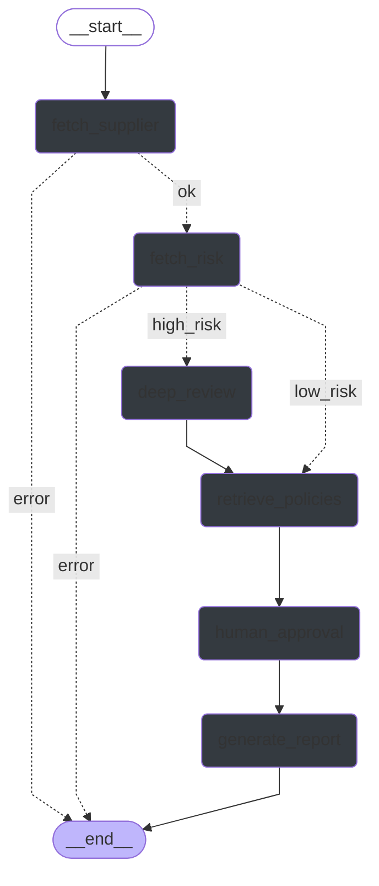

```mermaid
---
config:
  flowchart:
    curve: linear
---
graph TD;
        __start__([<p>__start__</p>]):::first
        fetch_supplier(fetch_supplier)
        fetch_risk(fetch_risk)
        deep_review(deep_review)
        retrieve_policies(retrieve_policies)
        human_approval(human_approval)
        generate_report(generate_report)
        __end__([<p>__end__</p>]):::last
        __start__ --> fetch_supplier;
        deep_review --> retrieve_policies;
        fetch_risk -. &nbsp;error&nbsp; .-> __end__;
        fetch_risk -. &nbsp;high_risk&nbsp; .-> deep_review;
        fetch_risk -. &nbsp;low_risk&nbsp; .-> retrieve_policies;
        fetch_supplier -. &nbsp;error&nbsp; .-> __end__;
        fetch_supplier -. &nbsp;ok&nbsp; .-> fetch_risk;
        human_approval --> generate_report;
        retrieve_policies --> human_approval;
        generate_report --> __end__;
        classDef default fill:#343a40,line-height:1.2
        classDef first fill-opacity:0
        classDef last fill:#bfb6fc

```
